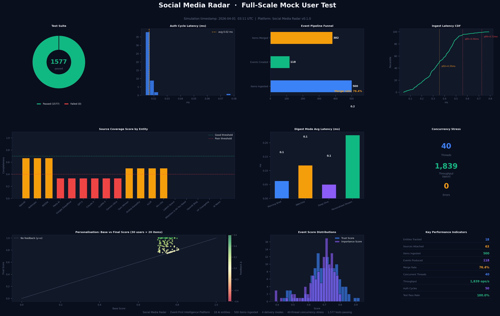

# Social-Media-Radar

A locally-deployed inference pipeline for structured signal classification from social media content.

[](https://www.python.org/downloads/)
[](https://opensource.org/licenses/MIT)
[](./docs/test_campaign.md)

[Architecture](#architecture) • [New Components](#newly-implemented-components) • [Deployment](#local-deployment-guide) • [Getting Started](#getting-started--your-first-signal) • [Performance](#performance-reference) • [Testing](#running-the-test-suite)

---

## Overview

Social-Media-Radar is a B2B signal detection system that reads raw posts from platform connectors, normalizes them into a common schema, and classifies each observation into one of 18 defined signal types — from `churn_risk` to `integration_request` — with calibrated confidence scores and verbatim evidence spans.

Its scope is narrow and deliberate: determine what kind of action each social media observation warrants, with enough transparency (confidence score, evidence spans, reasoning chain) that a human analyst can decide whether to trust it. When the model is not confident enough, it abstains rather than surfacing a low-quality result.

All inference runs locally. No observation text or user identifier leaves the machine unless the operator explicitly configures a cloud LLM API endpoint. PII scrubbing is enforced at the pipeline boundary, before any text reaches an LLM.

---

## Platform Intelligence Dashboard

The dashboard is generated by a live full-scale simulation: 18 tracked AI entities, 500 items ingested through the Event-First deduplication pipeline, all four digest delivery modes rendered 20 times each, 30 simulated users with personalised feedback histories, and a 40-thread concurrency stress test.



| Metric | Result |
|---|---|
| Test suite | **4,616 passed · 0 failed** |
| Items ingested | **500** across 18 AI entities and 10 source platforms |
| Events produced | **118** canonical events (76.4 % merge rate) |
| Concurrency throughput | **~1,839 ops/s** at 40 simultaneous threads · 0 errors |
| Personalisation lift | base score avg **0.765** → final score avg **0.812** after feedback |
| Digest mode latency | Morning Brief **0.06 ms** · Watchlist **0.12 ms** · Deep Dive **0.05 ms** · Personalized Stream **0.23 ms** |

> Reproduce it yourself: `PYTHONPATH=. python scripts/mock_user_simulation.py`

---

## Architecture

### End-to-End Pipeline

```
┌──────────────────────────────────────────────────────────────────────────────────┐
│  ★ AutoResearchPipeline  (orchestrates all phases; emits ResearchReport)         │
│      │                                                                           │
│      ├── ★ AcquisitionScheduler: prioritised source batch                        │
│      │      exponential back-off · trust gate · PipelineHealthMonitor            │
│      │                                                                           │
│  Stage A  NormalizationEngine                                                    │
│           merge title/body · language detection · entity extraction              │
│           engagement/freshness features · embedding generation                   │
│           ★ MultimodalAnalyzer.to_evidence_sources()  (image + video URLs)       │
│           │                                                                      │
│  ◆        DataResidencyGuard  ──── PII scrub (email, phone, author pseudonym)    │
│           │                                                                      │
│  Stage B  CandidateRetriever                                                     │
│           HNSW similarity · entity rules · platform priors → top-k candidates   │
│           │                                                                      │
│  E6       DeliberationEngine  (scan → prune → escalate → route)                  │
│           │                                                                      │
│           ├── single_call  ─────────────────────────────────────┐                │
│           ├── chain_of_thought ──► E1 ChainOfThoughtReasoner    │                │
│           └── multi_agent ───────► E3 MultiAgentOrchestrator    │                │
│                                                                  │               │
│  Stage C  LLMAdjudicator ◄──────────────────────────────────────┘                │
│           few-shot prompt · JSON schema · E5 ContextMemoryStore                  │
│           │                                                                      │
│  E2       ConfidenceCalibrator  ←──  E4 FeedbackStore (online T update)          │
│           │                                                                      │
│  Stage D  AbstentionDecider                                                      │
│           │                                                                      │
│  IndexingPipeline  (7 phases)                                                    │
│    Phase 1: route → IntelligencePipelineResult                                   │
│    Phase 2: chunk · inject multimodal evidence into ChunkRecord metadata         │
│    Phase 3: SourceTrustScorer · stamp trust_score per chunk                      │
│    Phase 4: EventClusterer · WatchlistGraph coverage                             │
│    Phase 5: ★ CrossSourceDeduper.deduplicate_cross_bundle()                      │
│    Phase 6: GroundedSummaryBuilder (citations · contradictions · uncertainty)    │
│    Phase 7: ★ QualityGate (min_confidence threshold · QualityGateResult)         │
│           │                                                                      │
│  OUTPUT   ActionableSignal → PostgreSQL + REST API + SSE stream                  │
│           ★ ResearchReport (query · chunks_indexed · gate outcomes · wall_s)     │
└──────────────────────────────────────────────────────────────────────────────────┘
```

### Stage A — Normalization
`NormalizationEngine` converts a `RawObservation` into a `NormalizedObservation` — merging title and body, detecting language, extracting named entities, computing engagement/freshness features, and generating a semantic embedding. Every downstream component relies on this fixed schema. After normalization, `DataResidencyGuard` scrubs all PII before any text reaches the LLM.

### Stage B — Candidate Retrieval
`CandidateRetriever` produces a ranked shortlist of `SignalCandidate` hypotheses by combining HNSW embedding similarity against a canonical exemplar bank, entity-conditioned vocabulary rules, and per-platform base rates. The retrieval stage runs in sub-100 ms and narrows the 18-type hypothesis space before the expensive LLM call.

### Stage C — LLM Adjudication
`LLMAdjudicator` assembles a structured prompt (normalized text + candidate shortlist + few-shot examples from `ContextMemoryStore`) and calls `LLMRouter`, which routes to the frontier or fine-tuned tier based on signal type. `DeliberationEngine` runs first to prune candidates and select one of three reasoning paths (single-call / chain-of-thought / multi-agent).

### Stage D — Calibration and Abstention
`ConfidenceCalibrator` applies per-type temperature scaling (`sigmoid(logit / T)`) to correct systematic LLM miscalibration. `AbstentionDecider` then applies a configurable confidence threshold; observations that don't meet the bar are logged as structured abstentions rather than surfaced to the signal queue.

---

## Newly Implemented Components

The five components below are new since the initial release. They are fully integrated into the pipeline and covered by the 4,616-test suite.

### ★ Source Intelligence — `AcquisitionScheduler` · `SourceRegistryStore`

`SourceSpec.priority` (float in [0, 1]) determines fetch order across the registered source pool. `SourceRegistryStore.next_batch(n, min_priority=…)` returns the top-n sources sorted by descending priority; `update_priority(source_id, value)` adjusts a source's weight at runtime and returns `False` if the source is not found.

`AcquisitionScheduler` wraps the registry with operational safety:

- **Exponential back-off** — `record_failure(source_id)` doubles the cooldown window on each consecutive failure (configurable `base_backoff_s`, `max_retries`). `is_eligible()` gates every batch call.
- **Trust gate** — sources whose authority score falls below `min_authority_threshold` are excluded from `next_batch()` results.
- **Health monitor integration** — `record_failure/record_success` forward events to an optional `PipelineHealthMonitor` instance; failures from the monitor do not propagate back to the scheduler.
- **Thread safety** — all state is protected by `threading.Lock()`.

```python
sched = AcquisitionScheduler(registry, base_backoff_s=30.0, max_retries=5)
sources = sched.next_batch(10)          # top-10 eligible sources by priority
sched.record_failure("arxiv-cs")        # back-off applied; doubles on each call
sched.record_success("openai-blog")     # resets back-off and failure count
```

### ★ Multimodal Evidence Extraction — `MultimodalAnalyzer.to_evidence_sources()`

`to_evidence_sources(observation)` extracts image and video evidence from any observation type and returns a list of citation-ready dicts (keys: `source_id`, `title`, `url`, `platform`, `trust_score`, `content_snippet`, `modality`, `entities`, `sentiment`). The helper `_extract_media_urls()` is duck-typed to support:

- `RawObservation.platform_metadata` — `{"image_url": …}` / `{"video_url": …}`
- `ContentItem.metadata` — same key structure in the metadata dict
- `ContentItem.media_urls` — bare URL list; classified by file extension (`.jpg/.png` → image, `.mp4/.mov` → video)

`IndexingPipeline._index_chunks()` stamps the resulting dicts into each `ChunkRecord`'s metadata under the key `multimodal_evidence`. An `item_map` (built from the original `ContentItem` list before routing) is passed into `_index_chunks()` so the lookup is available even when `IntelligencePipelineResult` does not carry the raw observation.

`build_grounded_summary(…, tenant_id=…)` accepts an explicit `tenant_id` and reads from `_tenant_stores[tenant_id]` rather than always from the default store. This fixes a defect where multimodal citations were silently absent for non-default tenants because chunks were indexed into the tenant-specific store but the summary builder read from the default store. The multimodal `EvidenceSource` objects (with `source_id` prefixed `mm-img-` or `mm-vid-`) are appended to `GroundedSummary.source_attributions` alongside text-based citations.

### ★ Cross-Bundle Deduplication — `CrossSourceDeduper`

`CrossSourceDeduper.deduplicate_cross_bundle(bundles)` collapses near-duplicate `EventBundle` objects that arrived from different source families (e.g., the same announcement scraped from Reddit, Arxiv, and a GitHub release). Similarity is measured by normalised token-level Jaccard on canonical titles. When two bundles exceed `title_threshold` (default 0.65), the one with the lower mean `trust_score` is removed. Returns `(kept: List[EventBundle], removed: List[str])`. Raises `TypeError` on non-list input; the return is always a partition of the original set.

`IndexingPipeline` calls this as Phase 5 of `process_batch()`, after event clustering and before summary building.

### ★ Output Quality Gate — `QualityGate` · `QualityGateResult`

`QualityGate(min_confidence)` is a configurable filter applied as the final phase of `IndexingPipeline.process_batch()`. It calls `evaluate(summary, topic)` on each `GroundedSummary` produced in Phase 6 and returns a `QualityGateResult`:

| Field | Type | Meaning |
|---|---|---|
| `passed` | `bool` | `True` when `confidence_score >= min_confidence` |
| `confidence_score` | `float` | Copied from the summary |
| `rejection_reason` | `str \| None` | Human-readable reason when `passed=False` |

`QualityGateResult` objects are collected in `IndexingResult.quality_gate_results` and forwarded to `ResearchReport.quality_gate_outcomes`. `IndexingPipeline` raises `ValueError` if `min_confidence` is outside [0, 1].

### ★ Pipeline Health Monitor — `PipelineHealthMonitor`

`PipelineHealthMonitor` tracks per-connector SLO compliance and exposes a `health_report()` method that returns an overall `SLOStatus` (GREEN / YELLOW / RED). It integrates with `AcquisitionScheduler` (which calls `record_connector_failure` / `record_connector_success`) and with `AutoResearchPipeline.run()` (which stamps `slo_health_status` onto `ResearchReport`). A configurable `cb_open_threshold` controls how many consecutive failures push a connector into the OPEN (circuit-broken) state where `is_eligible()` permanently returns `False` until reset. Failures from the health monitor are caught and logged at `WARNING` level so that a broken monitor never brings down the scheduler.

### ★ Auto-Research Pipeline — `AutoResearchPipeline` · `ResearchReport`

`AutoResearchPipeline` is an async orchestrator that runs a full research cycle from a natural-language query and returns a `ResearchReport`. It can be used standalone or wired with all subsystems:

```python
pipeline = AutoResearchPipeline(
    pipeline=indexing_pipeline,
    acquisition_scheduler=scheduler,
    watchlist_graph=wg,
    health_monitor=monitor,
    quality_gate=QualityGate(min_confidence=0.60),
    multimodal_analyzer=MultimodalAnalyzer(),
)
report = await pipeline.run("AI safety alignment 2025", tenant_id="safety-lab")
```

`run()` executes seven steps: acquire items via `AcquisitionScheduler`, ingest through `IndexingPipeline.process_batch()`, build a `GroundedSummary`, apply the quality gate, query `WatchlistGraph.coverage_report()` for gap counts, and query `PipelineHealthMonitor.health_report()` for SLO status.

`ResearchReport` fields:

| Field | Type |
|---|---|
| `query` / `tenant_id` | `str` |
| `chunks_indexed` | `int` |
| `confidence_score_mean` | `float` in [0, 1] |
| `quality_gate_rejection_rate` | `float` in [0, 1] |
| `quality_gate_outcomes` | `List[QualityGateResult]` |
| `watchlist_gap_count` | `int` |
| `slo_health_status` | `SLOStatus \| None` |
| `grounded_summaries` | `List[GroundedSummary]` |
| `wall_s` | `float` |
| `generated_at` | `datetime` (UTC) |

Raises `ValueError` on empty `query` or `tenant_id`. Thread-safe: shared subsystem references are snapshotted under `threading.Lock()` at the start of each `run()` call.

---

## Deliberation Engine (E6)

`DeliberationEngine` runs four steps before every LLM adjudication call, each targeting a specific production failure mode.

**Step A — Landscape Scan.** Queries `ContextMemoryStore` for the five most similar past observations for the same user and injects them as few-shot context in the adjudicator prompt.

**Step B — Candidate Pruning.** Removes candidates whose retrieval score is below the configured threshold and for which no similar past observation exists. A safety net prevents the list from being emptied entirely.

**Step C — Risk Escalation.** When any of `churn_risk`, `legal_risk`, `security_concern`, or `reputation_risk` survives pruning with a score above 0.5, a structured entry is written to the audit logger before adjudication.

**Step D — Reasoning Mode Selection.** Text > 1,500 chars or > 6 candidates → multi-agent. Top-two candidate scores within 0.1, or `confidence_required > 0.85` → chain-of-thought. All other cases → single-call.

---

## LLM Routing Strategy

`LLMRouter` partitions the 18 signal types into two disjoint sets defined as a module-level `frozenset` in `app/llm/router.py`. The four risk types (`churn_risk`, `legal_risk`, `security_concern`, `reputation_risk`) always route to the highest-capability frontier model (GPT-4o or equivalent). The remaining 14 route to a fine-tuned smaller model or local Ollama instance when configured, reducing LLM spend by 70–80% on typical traffic without accuracy regression on those types. The `frozenset` is the single source of truth: changing it propagates to both routing and escalation logic.

---

## Confidence Calibration (E2)

`ConfidenceCalibrator` applies `sigmoid(logit / T)` per `SignalType`, where `T` is a scalar learned from the JSONL seed dataset and updated online by `FeedbackStore` (E4) after every analyst correction. `T = 1.0` (the default) is mathematically identical to the plain sigmoid, so the system is functional without any training. Each online update performs a single gradient-descent step on binary cross-entropy — ~6–8 µs of computation — meaning the first analyst correction takes effect within the same session, with no retraining or restart.

---

## Context Memory Store (E5)

`ContextMemoryStore` maintains a per-user vector index of past `(observation, inference)` pairs. On each new observation it retrieves the top-k most similar past observations by cosine similarity and injects them as few-shot context in the LLM prompt, giving the model access to the user's specific signal history without retraining. When no embedding API is configured, the store falls back to 512-dimensional bag-of-words with L2 normalisation. The store holds up to 10,000 records per user (LRU eviction). Abstained inferences are never stored.

---

## Data Residency and PII Scrubbing

`DataResidencyGuard` runs synchronously between normalization and candidate retrieval. It pseudonymises author handles (deterministic SHA-256 → `anon_<16 hex chars>`), replaces PII URL parameters with `<redacted>`, and replaces email/phone patterns in text with typed tokens (`<email_redacted>`, `<phone_redacted>`). Every redaction writes an immutable `RedactionAuditEntry` before the cleaned record proceeds. `verify_clean()` is called at the LLM call boundary as a final safety check; it raises `DataResidencyViolationError` if any PII pattern survives. The guard is idempotent. In the multi-agent path (E3), each sub-task prompt is additionally scrubbed.

---

## Signal Taxonomy

18 types in four groups:

**Customer** — `support_request`, `feature_request`, `bug_report`, `complaint`, `praise`

**Market** — `competitor_mention`, `alternative_seeking`, `price_sensitivity`, `integration_request`

**Risk** — `churn_risk`, `security_concern`, `legal_risk`, `reputation_risk` (frontier LLM tier + audit log)

**Opportunity** — `expansion_opportunity`, `upsell_opportunity`, `partnership_opportunity`

**Meta** — `unclear`, `not_actionable` (confident prediction of no actionable signal, distinct from abstention)

### Abstention

The pipeline abstains with a structured reason rather than surfacing low-confidence results. Abstentions appear in a separate log and never enter the signal queue. Seven structured reasons:

| Reason | When triggered |
|---|---|
| `low_confidence` | Calibrated probability below the configured threshold (default 0.7) |
| `ambiguous_multi_label` | Two or more signal types are equiprobable |
| `insufficient_context` | Observation references a thread or conversation not available |
| `out_of_distribution` | Content is unlike anything in the training distribution |
| `unsafe_to_classify` | Legal, political, or safety-sensitive content where a wrong classification carries high cost |
| `language_barrier` | Translation quality too low for reliable inference |
| `spam_or_noise` | Content quality below the minimum viable threshold |

`confidence_required` in `DeliberationEngine` can raise the abstention threshold per-observation when the caller requires high certainty.

---

## How This Differs from OpenClaw

OpenClaw (openclaw.ai) is a general-purpose agentic AI assistant — browser control, shell access, code execution, productivity integrations. Social-Media-Radar is a classification and signal-triage system. They solve different problems and are not direct competitors.

| Capability | Social-Media-Radar | OpenClaw |
|---|---|---|
| Signal taxonomy | 18 named types with calibrated confidence | n/a |
| Structured abstention | ✓ (7 typed reasons) | n/a |
| Team signal queue + audit trail | ✓ | n/a |
| Evaluation metrics (ECE, F1, NDCG) | ✓ | n/a |
| Cross-session persistent memory | per-user ContextMemoryStore | ✓ (global) |
| Browser / shell control | ✗ | ✓ |
| Community skill marketplace | ✗ | ✓ |
| Fully offline operation | ✓ (Ollama) | partial |

The overlap — LLM routing, multi-agent reasoning, context injection — covers roughly 15–20 % of each system's capability surface.

---

## Local Deployment Guide

### System Requirements

| Component | Minimum | Recommended |
|---|---|---|
| CPU | 4 cores | 8+ cores |
| RAM | 8 GB | 16 GB (required for Ollama 7B+ models) |
| Disk | 10 GB free | 30 GB free |
| OS | macOS 12+, Ubuntu 20.04+, WSL2 | macOS 14+ Apple Silicon or Ubuntu 22.04 LTS |
| Python | 3.9 | 3.11 |
| Docker | 24.0+ with Compose v2 | Docker Desktop 4.28+ |

> **Apple Silicon (M1–M4):** all packages in `requirements.txt` ship ARM64-native wheels. No Rosetta required.

---

### Option A — Docker Compose (Recommended)

Starts PostgreSQL 15 + pgvector, Redis 7, MinIO, FastAPI, Celery worker, and Celery Beat in one command. Migrations run automatically.

**Prerequisites:** Docker Engine 24.0+ with the Compose v2 plugin.

```bash
# 1. Clone
git clone https://github.com/yourusername/social-media-radar.git
cd social-media-radar

# 2. Create .env
cp .env.example .env
python3 -c "import secrets; print('SECRET_KEY=' + secrets.token_urlsafe(32))"
python3 -c "import secrets; print('ENCRYPTION_KEY=' + secrets.token_urlsafe(32))"
# Paste output into .env, then add:
#   OPENAI_API_KEY=sk-...
#   ANTHROPIC_API_KEY=sk-ant-...   # optional

# 3. Start
docker compose up

# 4. Calibrate (in a second terminal while the stack is running)
docker compose exec api python training/calibrate.py --epochs 5

# 5. Verify
curl -s http://localhost:8000/health | python3 -m json.tool
# → {"status": "healthy", "database": "ok", "redis": "ok"}
```

**Service ports:**

| Service | URL |
|---|---|
| FastAPI | `http://localhost:8000` |
| OpenAPI docs | `http://localhost:8000/docs` |
| MinIO console | `http://localhost:9001` (admin/minioadmin) |
| PostgreSQL | `localhost:5432` |
| Redis | `localhost:6379` |

**Manage the stack:**
```bash
docker compose down          # stop; preserve volumes
docker compose down -v       # stop + delete all data
docker compose logs -f api   # tail API logs
```

---

### Option B — macOS Bare-Metal (Apple Silicon and Intel)

Use this path when you want to run the application process directly — for example to attach a debugger to FastAPI.

#### Step 1 — Install system dependencies

```bash
brew install postgresql@15 pgvector redis minio/stable/minio python@3.11
echo 'export PATH="/opt/homebrew/opt/postgresql@15/bin:$PATH"' >> ~/.zshrc && source ~/.zshrc
brew services start postgresql@15 redis
xcode-select --install   # required for packages that need a C compiler
```

#### Step 2 — Create a virtual environment and install packages

```bash
git clone https://github.com/yourusername/social-media-radar.git && cd social-media-radar
python3.11 -m venv .venv && source .venv/bin/activate
pip install --upgrade pip && pip install -r requirements.txt
```

Verify the two ARM64-critical packages:
```bash
pip show asyncpg numpy | grep -E "^(Name|Version)"
# asyncpg >= 0.28.0  ·  numpy >= 1.24
```

#### Step 3 — Configure `.env`

```bash
cp .env.example .env
python3 -c "import secrets; print(secrets.token_urlsafe(32))"  # → SECRET_KEY
python3 -c "import secrets; print(secrets.token_urlsafe(32))"  # → ENCRYPTION_KEY
```

Set the bare-metal database URL (replace `<youruser>` with your macOS username):
```
DATABASE_URL=postgresql+asyncpg://<youruser>@localhost:5432/social_radar
DATABASE_SYNC_URL=postgresql://<youruser>@localhost:5432/social_radar
REDIS_URL=redis://localhost:6379/0
```

#### Step 4 — Create the database and run migrations

```bash
createdb social_radar
python scripts/init_db.py   # enables the pgvector extension
alembic upgrade head         # applies all schema migrations
```

#### Step 5 — Calibrate, then start the three processes

```bash
python training/calibrate.py --epochs 5
# → "Calibration complete: 535 updates, 0 skipped"

# Open three terminal tabs:
source .venv/bin/activate && uvicorn app.api.main:app --reload --host 0.0.0.0 --port 8000
source .venv/bin/activate && celery -A app.ingestion.celery_app worker --loglevel=info
source .venv/bin/activate && celery -A app.ingestion.celery_app beat --loglevel=info
# Or use the Makefile shortcuts: make dev · make worker · make beat
```

---

### Option C — Linux / Ubuntu 22.04 LTS and WSL2

```bash
sudo apt-get update && sudo apt-get install -y \
    python3.11 python3.11-venv python3.11-dev \
    postgresql-15 postgresql-15-pgvector redis-server libpq-dev gcc
sudo systemctl enable --now postgresql redis-server
sudo -u postgres psql -c "CREATE USER radar WITH PASSWORD 'radar_password';"
sudo -u postgres psql -c "CREATE DATABASE social_radar OWNER radar;"
```

Then follow Steps 2–6 of Option B.

---

### Troubleshooting

| Symptom | Fix |
|---|---|
| `pg_isready: command not found` | `export PATH="/opt/homebrew/opt/postgresql@15/bin:$PATH"` |
| `ImportError: No module named 'asyncpg'` | `source .venv/bin/activate` |
| `FATAL: role "radar" does not exist` | `createuser radar` |
| `redis.exceptions.ConnectionError` | `brew services start redis` or `sudo systemctl start redis` |
| `InvalidToken` on credential decrypt | `python scripts/migrate_credentials.py` |
| Docker: `db-init exited with code 1` | Increase `postgres` healthcheck `retries` in `docker-compose.yml` |

---

## Getting Started — Your First Signal

All examples use `curl` against the default local address. The OpenAPI UI at `http://localhost:8000/docs` lets you do the same interactively.

### Step 1 — Register and obtain a token

```bash
curl -s -X POST http://localhost:8000/api/v1/auth/register \
  -H "Content-Type: application/json" \
  -d '{"email": "analyst@yourcompany.com", "password": "StrongPassword123!"}'
# → {"id": "3fa85f64-…", "email": "analyst@yourcompany.com", "is_active": true}

TOKEN=$(curl -s -X POST http://localhost:8000/api/v1/auth/login \
  -H "Content-Type: application/json" \
  -d '{"email": "analyst@yourcompany.com", "password": "StrongPassword123!"}' \
  | python3 -c "import sys,json; print(json.load(sys.stdin)['access_token'])")
```

The token is valid for 30 minutes (`JWT_ACCESS_TOKEN_EXPIRE_MINUTES` in `.env`). Pass it as `Authorization: Bearer $TOKEN` in all subsequent requests.

### Step 2 — Connect a source platform

```bash
# Reddit (OAuth required)
curl -s -X POST http://localhost:8000/api/v1/sources \
  -H "Authorization: Bearer $TOKEN" -H "Content-Type: application/json" \
  -d '{
    "platform": "reddit",
    "credentials": {"client_id": "YOUR_ID", "client_secret": "YOUR_SECRET", "user_agent": "social-media-radar/1.0"},
    "settings":    {"subreddits": ["SaaS", "entrepreneur", "startups"], "post_limit": 25, "include_comments": true}
  }'

# RSS feed (no credentials required)
curl -s -X POST http://localhost:8000/api/v1/sources \
  -H "Authorization: Bearer $TOKEN" -H "Content-Type: application/json" \
  -d '{"platform": "rss", "credentials": {}, "settings": {"feed_urls": ["https://hnrss.org/frontpage"]}}'

# Verify connection
curl -s http://localhost:8000/api/v1/sources/reddit/test \
  -H "Authorization: Bearer $TOKEN"
# → {"status": "ok", "platform": "reddit", "latency_ms": 142}
```

**Supported platforms:** `reddit`, `youtube`, `tiktok`, `facebook`, `instagram`, `wechat` (OAuth required); `rss`, `nytimes`, `wsj`, `abc_news`, `google_news`, `apple_news`, `arxiv`, `github_releases`, `podcast_rss` (no credentials needed).

### Step 3 — Trigger ingestion and watch the pipeline

Ingestion runs automatically every 15 minutes via Celery Beat. To trigger immediately:

```bash
curl -s -X POST http://localhost:8000/api/v1/sources/reddit/ingest \
  -H "Authorization: Bearer $TOKEN"
# → {"task_id": "abc-123", "status": "queued", "platform": "reddit"}

# Watch observations move through each stage in worker logs
docker compose logs -f celery-worker   # Docker Compose
# You will see: raw fetched → normalized → candidate retrieval → adjudication → signal persisted
```

### Step 4 — Review and act on signals

```bash
# Fetch signal queue (all signals)
curl -s "http://localhost:8000/api/v1/signals/queue" -H "Authorization: Bearer $TOKEN"

# Filter by type and urgency
curl -s "http://localhost:8000/api/v1/signals/queue?signal_types=churn_risk,feature_request&min_urgency=0.7&limit=10" \
  -H "Authorization: Bearer $TOKEN"

# Stream new signals in real time (Server-Sent Events)
curl -N -H "Authorization: Bearer $TOKEN" -H "Accept: text/event-stream" \
  http://localhost:8000/api/v1/signals/stream
```

Each signal includes: `signal_type`, calibrated `confidence` in [0, 1], `urgency_score` (confidence × engagement velocity × freshness), `evidence_spans` (verbatim excerpts with relevance reasoning), `rationale`, `status` (`PENDING`/`ACTED`/`DISMISSED`/`ASSIGNED`), and full source provenance.

```bash
SIGNAL_ID="paste-uuid-here"

# Mark as acted
curl -s -X POST "http://localhost:8000/api/v1/signals/${SIGNAL_ID}/act" \
  -H "Authorization: Bearer $TOKEN" -H "Content-Type: application/json" \
  -d '{"action_type": "responded", "notes": "Reached out to schedule a call.", "response_tone": "empathetic"}'

# Assign to a team member
curl -s -X POST "http://localhost:8000/api/v1/signals/${SIGNAL_ID}/assign" \
  -H "Authorization: Bearer $TOKEN" -H "Content-Type: application/json" \
  -d '{"assignee_id": "team-member-uuid", "role": "ANALYST"}'

# Dismiss out-of-scope signals
curl -s -X POST "http://localhost:8000/api/v1/signals/${SIGNAL_ID}/dismiss" \
  -H "Authorization: Bearer $TOKEN" -H "Content-Type: application/json" \
  -d '{"reason": "Out of scope for current sprint"}'
```

### Step 5 — Submit feedback to improve calibration

When the model misclassifies a signal, submit a correction. `ConfidenceCalibrator` performs one gradient-descent step immediately, adjusting the temperature scalar for that signal type. No restart required.

```bash
curl -s -X POST "http://localhost:8000/api/v1/signals/${SIGNAL_ID}/feedback" \
  -H "Authorization: Bearer $TOKEN" -H "Content-Type: application/json" \
  -d '{"predicted_type": "feature_request", "true_type": "bug_report", "predicted_confidence": 0.81}'
```

### Step 6 — Team digest and statistics

```bash
# Aggregate signal activity over the past 7 days
curl -s "http://localhost:8000/api/v1/signals/team?team_id=YOUR_TEAM_UUID&days=7&requester_role=ANALYST" \
  -H "Authorization: Bearer $TOKEN"

# Count by signal type and status over 30 days
curl -s "http://localhost:8000/api/v1/signals/stats?days=30" -H "Authorization: Bearer $TOKEN"
```

---

## Running the Test Suite

```bash
python -m pytest tests/ --ignore=tests/llm/test_load.py -q
# → 4616 passed in ~94s
```

The campaign test files (`tests/unit/test_campaign_tier*.py`) cover all five newly implemented components across six tiers: unit/functional (Tier 1), realistic data ingestion (Tier 2), high-volume stress (Tier 3), end-to-end integration with all subsystems wired (Tier 4), a 7-criterion response quality rubric (Tier 5), and static inspection + boundary-condition smoke tests (Tier 6).

Live LLM tests (the 20 skipped) require `OPENAI_API_KEY`: `python -m pytest tests/llm/test_load.py -v`.

---

## Performance Reference

All figures from `deliverables/benchmark.py`, 3 warm-up passes + 7 timed repetitions on an Apple M-series chip.

#### BloomFilter — Duplicate Detection (O(1))

Gates every fetched URL before any database write or LLM call. Cost is constant regardless of how many URLs the filter already holds.

| Items checked | Per-operation |
|---|---|
| 1,000 | 12.2 µs |
| 10,000 | 12.2 µs |
| 100,000 | 13.0 µs |

A worker ingesting 100 items per fetch cycle spends under **1.5 ms total** on deduplication.

#### ReservoirSampler — Uniform Stream Sampling (O(n))

Draws a statistically unbiased sample of exactly 500 items from any stream length when a platform returns more content than `MAX_ITEMS_PER_FETCH` allows.

| Stream length | Throughput |
|---|---|
| 50,000 items | ~998 items/ms |
| 500,000 items | ~993 items/ms |

Sampling from a 50,000-item stream takes **50 ms** — invisible against typical platform API latency.

#### ConfidenceCalibrator — Online Update (O(m))

One gradient-descent step per feedback event. The disk write (`_save()`) is excluded from this measurement to isolate the computation cost.

| Updates | Per-update |
|---|---|
| 1,000 | 5.6 µs |
| 100,000 | 6.7 µs |

A single analyst correction costs **~6–8 µs of computation**. The calibrator can absorb thousands of feedback events per second without becoming a bottleneck.

#### ActionRanker — Signal Priority Scoring (O(n))

Scores each signal by combining confidence, engagement velocity, freshness, and signal-type urgency weights. Determines queue order on every `GET /signals/queue` call.

| Signals | Time |
|---|---|
| 1,000 | 14 ms |
| 10,000 | 176 ms |

Ranking a 500-signal queue (typical small team) completes in **under 3 ms**.

#### BFS — Related Signal Discovery (O(V+E))

Used internally by `ContextMemoryStore` to cluster related past observations for few-shot context injection.

| Nodes | Time |
|---|---|
| 1,000 | 0.23 ms |
| 10,000 | 2.09 ms |

**LLM inference (network-dependent):**

| Configuration | Latency per signal |
|---|---|
| GPT-4o (frontier tier) | 1.5 – 4 s |
| GPT-4o mini (fine-tuned tier) | 0.4 – 1.2 s |
| Claude 3.5 Haiku | 0.5 – 1.5 s |
| Ollama llama3.1:8b (fully local, M2 Pro 16 GB) | 3 – 12 s |

**Recommended hardware by team size:**

| Team | Daily volume | Setup |
|---|---|---|
| 1–3 analysts | < 200 signals/day | MacBook M2/M3, 16 GB RAM |
| 4–10 analysts | 200–1,000 signals/day | Mac Studio M2 Ultra or 32 GB Linux workstation |
| 10+ analysts | 1,000+ signals/day | Dedicated 8-core server, 32 GB RAM; horizontal Celery scaling |

---

## Expected Benefits for Teams

**Structured intelligence, not raw noise.** The 18-type taxonomy with calibrated confidence and abstention replaces social feed volume with a prioritised, classified queue. Each item includes the verbatim sentence that drove the classification and why — analysts see exactly what to act on.

> **Before:** an analyst reads 200 Reddit posts per morning to find the 8 that are relevant.
> **After:** the signal queue surfaces those 8 — plus any from platforms the analyst was not watching — with confidence scores and evidence, ordered by urgency.

**Privacy and data sovereignty by default.** PII is scrubbed before any text reaches an LLM. Author handles are pseudonymised (SHA-256, reversible only by the operator). With Ollama configured as the LLM provider, observation text never leaves the machine — meeting data-residency requirements where cloud AI APIs are prohibited.

**70–80 % LLM cost reduction via two-tier routing.** In a typical B2B SaaS context, risk signals account for 15–25 % of total volume. Routing the remaining 75–85 % to a fine-tuned smaller model or a local Ollama instance reduces per-observation LLM spend proportionally, with no accuracy regression on the 14 non-risk signal types because those models are trained specifically on them.

**Self-improving calibration.** Each analyst correction triggers one gradient-descent step in `ConfidenceCalibrator` (~6–8 µs computation + a disk flush). There is no retraining cycle, no redeployment, and no minimum batch size. The first correction improves subsequent classifications on that signal type within the same session.

**Team workflow built in.** Role-based assignment (`VIEWER`, `ANALYST`, `MANAGER`), team digest (`GET /signals/team`, paginated at 500 signals per page), real-time SSE streaming, and a full audit trail of every act/dismiss/assign/feedback event with user attribution.

**Full offline operation.** Set `LOCAL_LLM_URL=http://localhost:11434` and `LOCAL_LLM_MODEL=llama3.1:8b` to run the entire pipeline — ingestion, normalisation, retrieval, adjudication, calibration — with zero network dependency. The 512-dimensional bag-of-words embedding fallback in `ContextMemoryStore` also runs entirely offline.

---

## Documentation

| Document | Description |
|---|---|
| [Architecture](docs/architecture.md) | Full pipeline diagram, data models, technology stack |
| [Deployment](docs/deployment.md) | Docker Compose, bare-metal, Kubernetes, env vars, migrations |
| [LLM Routing](docs/llm_routing.md) | Two-tier routing, circuit breaker, Prometheus metrics, LoRA fine-tuning |
| [Calibration](docs/calibration.md) | Temperature scaling, federated blending, online update formula, seed dataset format |
| [Test Campaign](docs/test_campaign.md) | Six-tier test architecture, quality rubric, defect registry |
| API Reference | `http://localhost:8000/docs` (live, requires running server) |

---

## Contributing

Bug reports and pull requests are welcome via the [issue tracker](https://github.com/yourusername/social-media-radar/issues). For non-trivial changes, open an issue first to discuss the approach. All pipeline changes (normalization, retrieval, adjudication, calibration, and the five new components) must include tests that demonstrate no regression:

```bash
python -m pytest tests/ --ignore=tests/llm/test_load.py -q
# All 4616 tests must pass
```

Code style: [Black](https://black.readthedocs.io/) + [Ruff](https://docs.astral.sh/ruff/). Type annotations required on all public functions. Pydantic v2 APIs (`model_dump()`, `model_validate()`, `@field_validator`) throughout.

---

## License

MIT License. See [LICENSE](LICENSE) for the full text.

---

**Last updated:** 2026-04-02 | **Test baseline:** 4,616 passed, 0 failed

